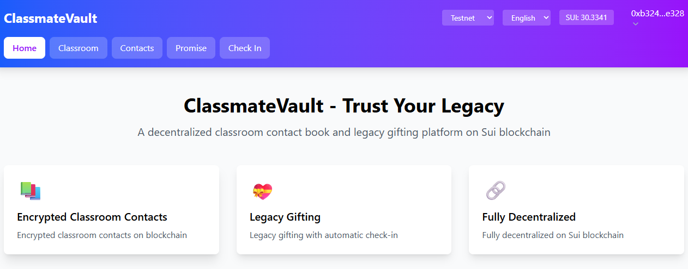
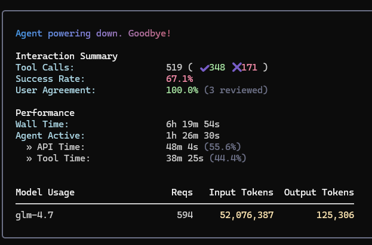

# ClassmateVault

* https://classmatevault.vercel.app/

A decentralized classroom contact directory and legacy gifting platform built on Sui blockchain.


## AI Usage Disclosure
### Vibe Coding by iflow 

### Model Name ：GLM-4.7
### Prompt Log ：[Prompt Log](prompt_log.md)

 
## Features :
- **📚 Encrypted Classroom Contacts** - Store and manage classroom contact information with encryption
- **💝 Legacy Gifting** - Create promises with automatic check-in to transfer assets to beneficiaries
- **🔗 Fully Decentralized** - Built on Sui blockchain with Move 2024 smart contracts
- **🌐 Multi-language Support** - Chinese and English interface
- **🌍 Network Support** - Both testnet and mainnet support

## Tech Stack

- **Smart Contracts**: Move 2024 (Sui Framework)
- **Frontend**: React + TypeScript + Vite
- **UI Framework**: Tailwind CSS v4
- **Wallet Integration**: @mysten/dapp-kit
- **Internationalization**: i18next

## Getting Started

### Prerequisites

- Node.js 18+
- npm or yarn
- A Sui wallet (e.g., Sui Wallet, Suiet)

### Installation

1. Clone the repository:
```bash
git clone <repository-url>
cd classmate
```

2. Install dependencies:
```bash
# Install frontend dependencies
cd frontend
npm install
```

### Deploy Smart Contracts

1. Build the contracts:
```bash
cd contracts
sui move build
```

2. Deploy to testnet:
```bash
sui client publish --gas-budget 100000000
```

3. Copy the deployed package ID and update `frontend/src/utils/config.ts`

### Run Frontend

1. Start the development server:
```bash
cd frontend
npm run dev
```

2. Open your browser and navigate to `http://localhost:5173`

3. Connect your Sui wallet and start using the app!

## Project Structure

```
classmate/
├── contracts/          # Move smart contracts
│   ├── sources/       # Contract source files
│   └── Move.toml      # Move package configuration
├── frontend/          # React frontend application
│   ├── src/
│   │   ├── pages/     # Page components
│   │   ├── contexts/  # React contexts
│   │   ├── i18n/      # Internationalization
│   │   └── utils/     # Utility functions
│   └── package.json
└── README.md
```

## Smart Contracts

### Classroom Module (`classmate.move`)

- `create_classroom`: Create a new classroom
- `add_student`: Add encrypted student information to a classroom

### Promise Module (`promise.move`)

- `create_promise`: Create a legacy gifting promise
- `check_in`: Check in to reset the timer

## Frontend Pages

- **Home**: Project introduction
- **Classroom**: Create and manage classrooms
- **Contacts**: Add and view encrypted student contacts
- **Promise**: Create legacy gifts and check in
- **Check In**: Quick check-in page

## Network Configuration

The app supports both testnet and mainnet. You can switch networks using the dropdown in the header.

- **Testnet**: https://fullnode.testnet.sui.io
- **Mainnet**: https://fullnode.mainnet.sui.io

## License

MIT

---

# ClassmateVault (中文)

基于 Sui 区块链的去中心化班级通讯录和生前赠款平台。

## 功能特性

- **📚 加密班级通讯录** - 加密存储和管理班级联系信息
- **💝 生前赠款** - 创建具有自动签到功能的资产转让承诺
- **🔗 完全去中心化** - 使用 Move 2024 智能合约构建在 Sui 区块链上
- **🌐 多语言支持** - 中文和英文界面
- **🌍 网络支持** - 支持测试网和主网

## 技术栈

- **智能合约**: Move 2024 (Sui Framework)
- **前端**: React + TypeScript + Vite
- **UI 框架**: Tailwind CSS v4
- **钱包集成**: @mysten/dapp-kit
- **国际化**: i18next

## 快速开始

### 前置要求

- Node.js 18+
- npm 或 yarn
- Sui 钱包（如 Sui Wallet, Suiet）

### 安装

1. 克隆仓库：
```bash
git clone <repository-url>
cd classmate
```

2. 安装依赖：
```bash
# 安装合约依赖
cd contracts
npm install

# 安装前端依赖
cd ../frontend
npm install
```

### 部署智能合约

1. 构建合约：
```bash
cd contracts
sui move build
```

2. 部署到测试网：
```bash
sui client publish --gas-budget 100000000
```

3. 复制部署的包 ID 并更新 `frontend/src/utils/config.ts`

### 运行前端

1. 启动开发服务器：
```bash
cd frontend
npm run dev
```

2. 在浏览器中打开 `http://localhost:5173`

3. 连接您的 Sui 钱包并开始使用！

## 项目结构

```
classmate/
├── contracts/          # Move 智能合约
│   ├── sources/       # 合约源文件
│   └── Move.toml      # Move 包配置
├── frontend/          # React 前端应用
│   ├── src/
│   │   ├── pages/     # 页面组件
│   │   ├── contexts/  # React 上下文
│   │   ├── i18n/      # 国际化
│   │   └── utils/     # 工具函数
│   └── package.json
└── README.md
```

## 智能合约

### 班级模块 (`classmate.move`)

- `create_classroom`: 创建新班级
- `add_student`: 添加加密的学生信息到班级

### 赠款模块 (`promise.move`)

- `create_promise`: 创建生前赠款承诺
- `check_in`: 签到以重置计时器

## 前端页面

- **首页**: 项目介绍
- **班级管理**: 创建和管理班级
- **通讯录**: 添加和查看加密的同学联系信息
- **生前赠款**: 创建赠款和签到
- **签到**: 快速签到页面

## 网络配置

应用支持测试网和主网。您可以使用顶部导航栏中的下拉菜单切换网络。

- **测试网**: https://fullnode.testnet.sui.io
- **主网**: https://fullnode.mainnet.sui.io

## 许可证

MIT